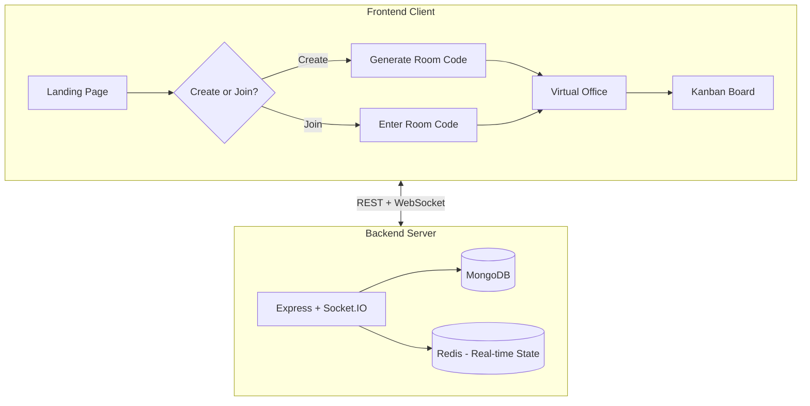
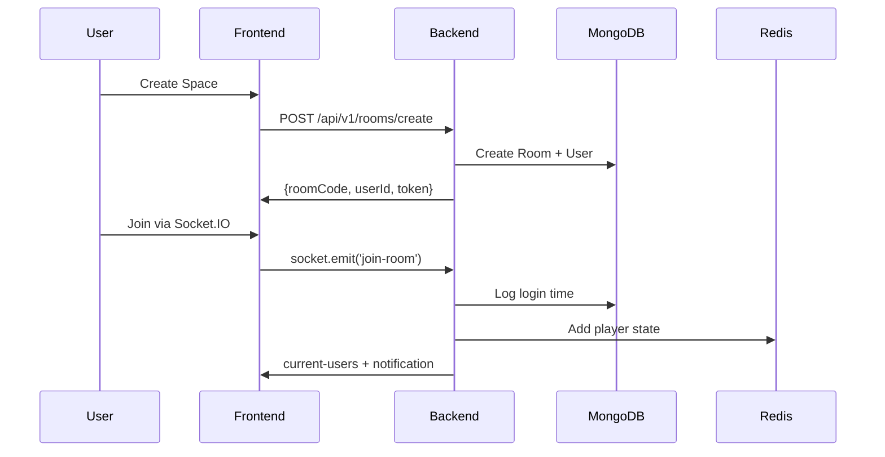
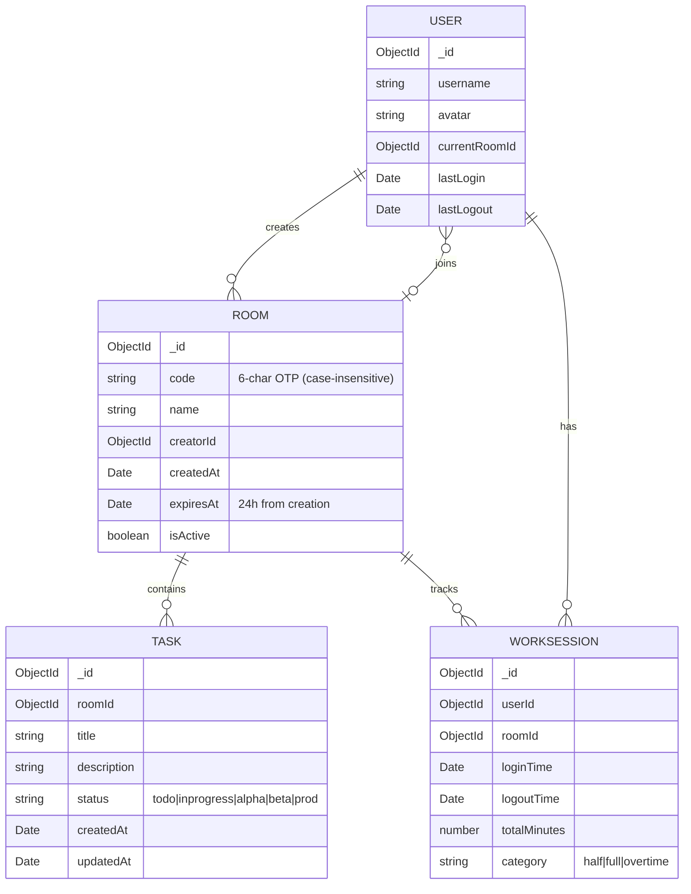

# Proximity Backend Enhancement - Implementation Plan

## Overview

Transform the current ephemeral Redis-based backend into a **persistent, room-based virtual office** with:
- **Room/Space System** with shareable OTP-like codes (case-insensitive)
- **Session Persistence** (24-hour sessions or until room abolished)
- **Kanban Board** (room-specific, real-time updates, anyone can work on any task)
- **Work Time Tracking** (login/logout with time calculations)
- **Toast Notifications** (join/quit/task updates)

---

## Architecture



### Data Flow



---

## MongoDB Schema Design

### Collections



---

## API Endpoints

### Room Management

| Endpoint | Method | Description |
|----------|--------|-------------|
| `/api/v1/rooms/create` | POST | Create room with OTP code |
| `/api/v1/rooms/join` | POST | Join room by code |
| `/api/v1/rooms/abolish` | POST | Creator deletes room |
| `/api/v1/rooms/:roomId` | GET | Get room details |

### Kanban Tasks

| Endpoint | Method | Description |
|----------|--------|-------------|
| `/api/v1/rooms/:roomId/tasks` | GET | Get all tasks for room |
| `/api/v1/rooms/:roomId/tasks` | POST | Create task |
| `/api/v1/tasks/:taskId` | PATCH | Update task |
| `/api/v1/tasks/:taskId` | DELETE | Delete task |

---

## Socket.IO Events

### Client → Server

| Event | Payload | Description |
|-------|---------|-------------|
| `join-room` | `{username, avatar, roomCode}` | Join room and log login time |
| `quit-room` | `{}` | Leave room and log logout time |
| `task-create` | `{title, description}` | Create new task |
| `task-update` | `{taskId, status?, title?, description?}` | Update task |
| `task-delete` | `{taskId}` | Delete task |

### Server → Client

| Event | Payload | Description |
|-------|---------|-------------|
| `user-joined` | `{username, avatar}` | Toast: User joined |
| `user-left` | `{username, totalTime, category}` | Toast: User left with work summary |
| `room-abolished` | `{}` | Room deleted, redirect to home |
| `task-created` | `Task` | New task added |
| `task-updated` | `Task` | Task moved/edited |
| `task-deleted` | `{taskId}` | Task removed |

---

## Kanban Columns

| Column | Status Key | Description |
|--------|------------|-------------|
| To Do | `todo` | New tasks |
| In Progress | `inprogress` | Active work |
| Alpha Testing | `alpha` | Internal testing |
| Beta Testing | `beta` | Extended testing |
| Prod (Done) | `prod` | Completed |

---

## Work Time Calculation

```javascript
function calculateWorkCategory(loginTime, logoutTime) {
  const hours = (logoutTime - loginTime) / 3600000;
  
  if (hours < 4) {
    return { category: 'half', display: 'Half Day' };
  } else if (hours <= 8) {
    return { category: 'full', display: 'Full Day' };
  } else {
    const overtime = Math.floor(hours - 8);
    return { category: 'overtime', display: `Full Day + ${overtime}h OT` };
  }
}
```

---

## New Files

| File | Purpose |
|------|---------|
| `src/config/db.ts` | MongoDB connection |
| `src/models/User.ts` | User schema |
| `src/models/Room.ts` | Room schema |
| `src/models/Task.ts` | Kanban task schema |
| `src/models/WorkSession.ts` | Work time tracking |
| `src/controllers/roomController.ts` | Room CRUD |
| `src/controllers/taskController.ts` | Task CRUD |
| `src/socket/kanbanHandler.ts` | Real-time Kanban |
| `src/socket/roomHandler.ts` | Room lifecycle |
| `src/middleware/auth.ts` | JWT verification |
| `src/utils/roomCode.ts` | Code generator |

---

## Environment Variables

Add to `.env`:
```
MONGODB_URI=mongodb://localhost:27017/proximity
JWT_SECRET=your-secret-key
```
